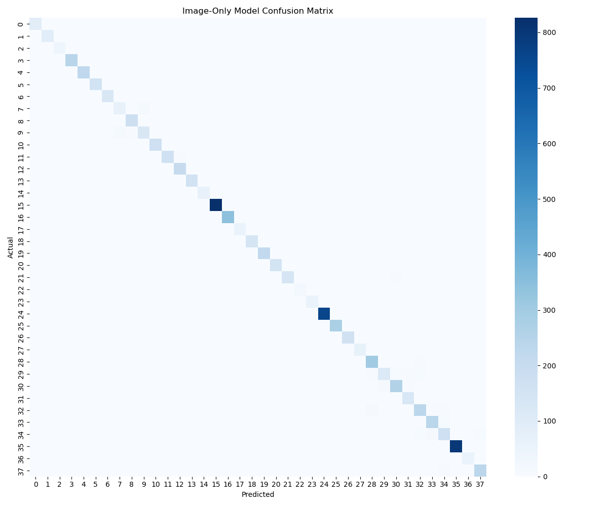
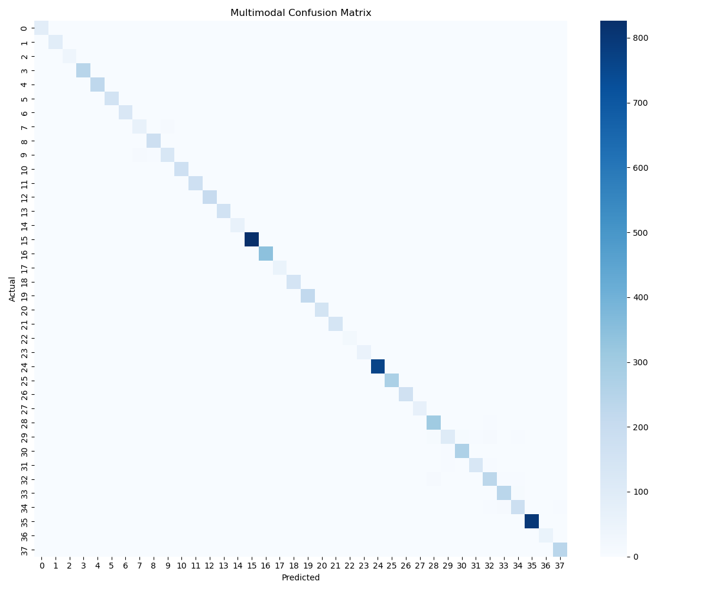
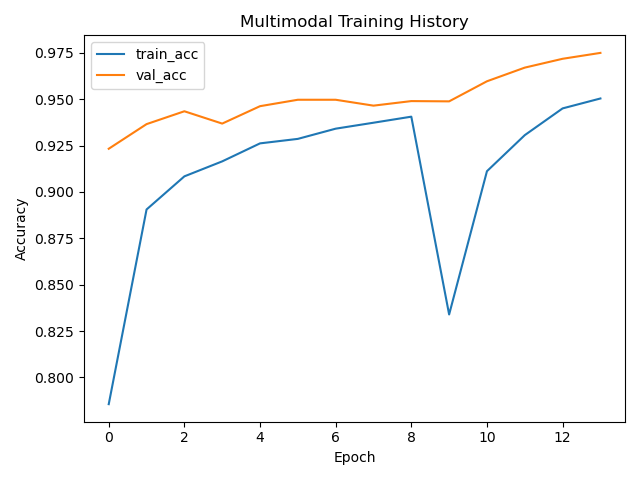
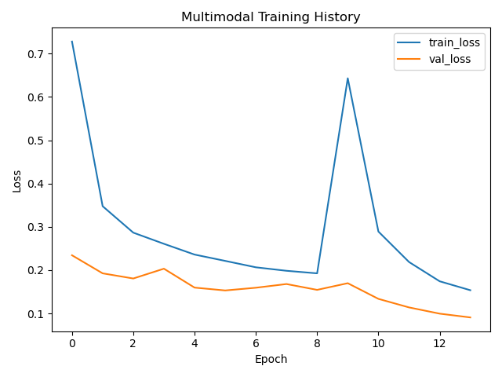

# 🌾 Multimodal Crop Disease Prediction

This project implements a multimodal machine learning framework for crop disease prediction using:

- Leaf image analysis (MobileNetV2)
- Environmental parameters (temperature, humidity, rainfall, etc.)
- Risk level estimation
- Recommendation generation

## 📌 Features

- Image-only baseline model (~97% accuracy on PlantVillage)
- Multimodal fusion model (Image + Environmental data)
- Risk assessment module
- Expandable to real climate datasets

## 🧠 Architecture

Image → CNN → Feature Extraction  
Environmental Data → MLP → Feature Extraction  
Fusion → Classification

## 📊 Dataset

PlantVillage dataset (images only).  
Environmental parameters are simulated for multimodal learning research.

## 🚀 Tech Stack

- Python
- TensorFlow / Keras
- Scikit-learn
- Pandas
- NumPy

---

Research-focused implementation.

## 📊 Results (PlantVillage)

| Model | Inputs | Val Accuracy | Notes |
|------|--------|-------------:|------|
| Image-only (MobileNetV2) | Leaf image | ~97.2% | Strong baseline on clean PlantVillage images |
| Multimodal (Ours) | Leaf image + Env (temp, humidity, rainfall, wind, season) | **97.5%** | Adds environmental context + enables risk & recommendations |

### Confusion Matrices
**Image-only:**  

**Multimodal:**  

### Training Curves (Multimodal)
  

